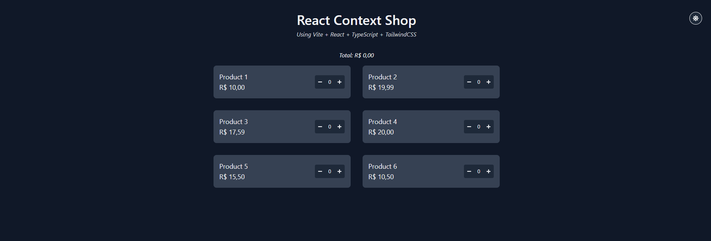

# 🛍️ React Context Shop

Projeto criado para praticar a Context API no React, com foco em manipulação de tema e gerenciamento de carrinho de compras.



## ✨ Tecnologias utilizadas

- [React](https://react.dev/)
- [TypeScript](https://www.typescriptlang.org/)
- [Vite](https://vitejs.dev/)
- [TailwindCSS](https://tailwindcss.com/)
- Context API (Tema + Carrinho)
- Acessibilidade e semântica HTML

## 📚 Funcionalidades

- Alternância entre tema claro e escuro 🌗
- Gerenciamento de carrinho com Context API
- Cálculo de total em tempo real
- Componente reutilizável para produtos
- Layout responsivo e acessível

## 🧠 Aprendizados

- Criação e consumo de múltiplos contextos no React
- Boas práticas com TypeScript e tipagem de contexto
- Aplicação de acessibilidade (aria-label, foco visível)
- Estilização com TailwindCSS

## 🚀 Como rodar o projeto localmente

```bash
git clone https://github.com/seu-usuario/lightcart.git
cd lightcart
npm install
npm run dev
